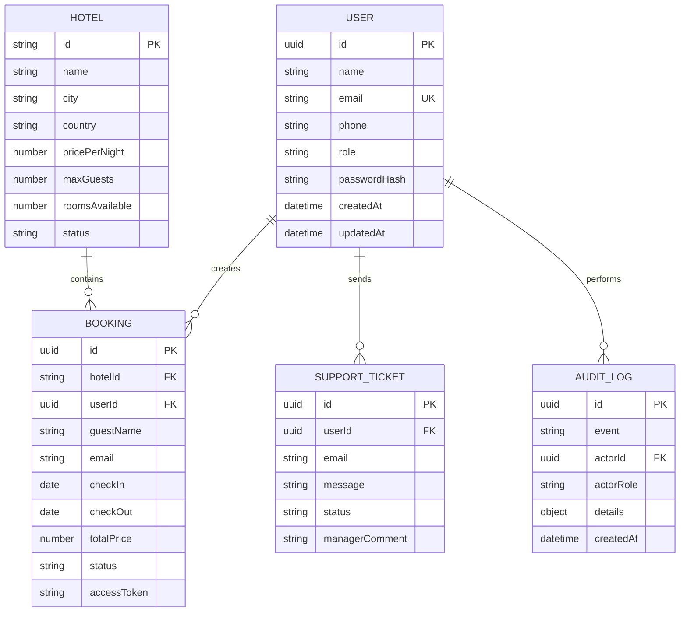

# Архитектура backend Roomly

Проект реализован как распределенный монолит: существующий frontend работает отдельно, backend предоставляет REST API и хранит данные в структурированном JSON-хранилище. Такой вариант проще защитить и запустить на компьютере преподавателя, чем полноценную СУБД, но структура backend разделена на слои.

## Слои

```text
backend/src/
├── app.js                # сборка Express-приложения и подключение маршрутов
├── server.js             # точка запуска сервера
├── seed.js               # начальные данные
├── config/               # переменные окружения
├── db/                   # слой хранения данных
├── middlewares/          # авторизация, валидация, ошибки, rate limit
├── routes/               # HTTP-маршруты REST API
├── services/             # бизнес-логика
└── utils/                # вспомогательные функции
```

## Основные сущности

- `User` — пользователь системы. Роли: `guest`, `manager`, `admin`.
- `Hotel` — отель, который можно просматривать и администрировать.
- `Booking` — бронирование номера на даты.
- `SupportTicket` — обращение пользователя в поддержку.
- `AuditLog` — журнал действий для аудита и безопасности.

## ERD в Crow's Foot-подобной нотации



## Использованные паттерны проектирования

1. **Repository-like layer** — `JsonDb` инкапсулирует чтение, запись, резервное копирование и атомарное сохранение данных. Остальные слои не работают с файловой системой напрямую.
2. **Service Layer** — бизнес-правила вынесены в `hotel.service.js`, `booking.service.js`, `support.service.js`, `auth.service.js`. Маршруты не содержат сложной бизнес-логики.
3. **Middleware Chain** — авторизация, валидация, rate limit и обработка ошибок реализованы как цепочка middleware Express.
4. **DTO/Public View** — функции `publicUser`, `publicHotel`, `publicBooking`, `publicTicket` возвращают наружу безопасные представления сущностей. Например, `passwordHash` никогда не попадает в API-ответ.

## Обработка ошибок

Все ошибки проходят через единый `errorHandler`. Пользователь получает понятное сообщение, а сервер не завершает работу аварийно. Для ошибок валидации возвращается массив `details`, где указано поле и причина ошибки.

## Безопасность

- пароли хешируются через `bcryptjs`;
- авторизация работает через JWT;
- доступ к административным действиям закрыт ролью `admin`;
- API использует `helmet`, CORS и ограничение частоты запросов;
- данные пользователей наружу отдаются без хеша пароля;
- действия пользователей пишутся в `auditLog`.

## Надежность хранения

Перед изменением JSON-файла backend создает резервную копию в `backend/data/backups`. Запись выполняется атомарно через временный файл и переименование. Это снижает риск повреждения данных при сбое во время записи.
